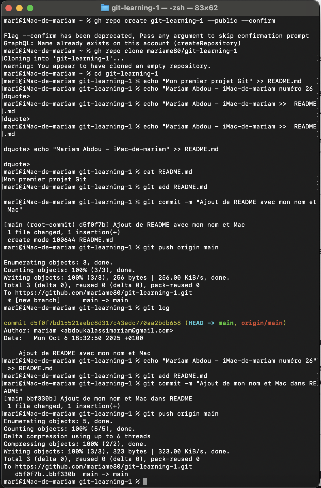
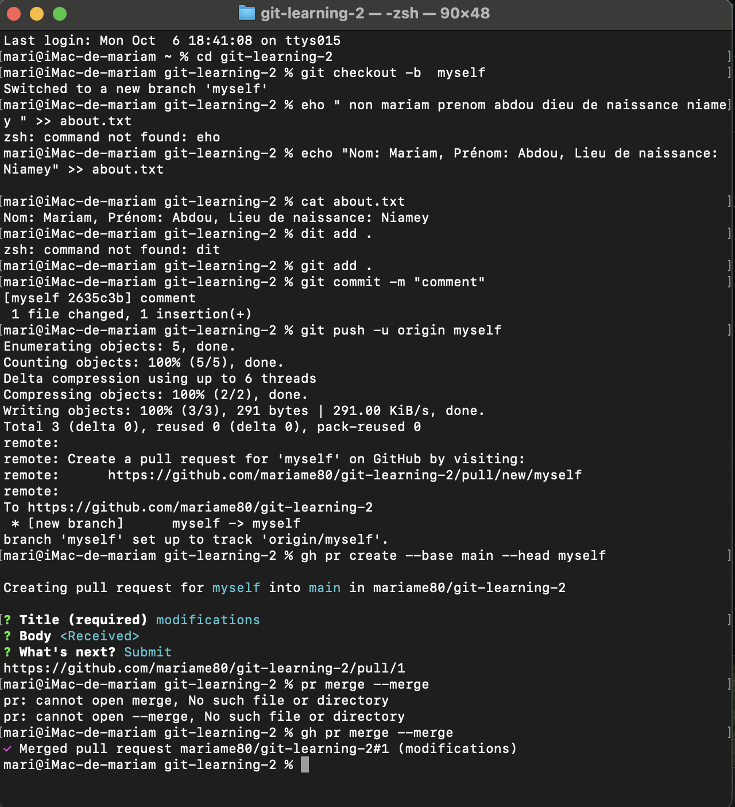
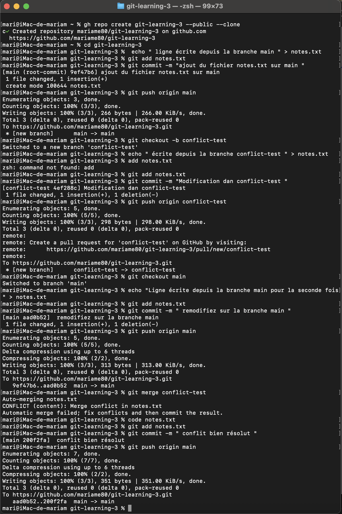

Explication des commandes utilisées – 
Exercice 1 : git-learning-1

gh repo create git-learning-1 --public --confirm : pour créer un dépôt GitHub appelé git-learning-1, le rendre public et confirmer la création sans question.

gh repo clone mariame80/git-learning-1 : pour cloner (copier) le dépôt distant mariame80/git-learning-1 sur ton ordinateur.

cd git-learning-1 : cd = change directory  pour entrer dans le dossier du projet git-learning-1.

echo "Mon premier projet Git" >> README.md : pour écrire la ligne Mon premier projet Git à la fin du fichier README.md (le crée s’il n’existe pas).

echo "Mariam Abdou - iMac-de-mariam numéro 26" >> README.md : pour ajouter une nouvelle ligne (mon nom) à la fin de README.md.

cat README.md : pour afficher dans le terminal le contenu du fichier README.md.

git add README.md : pour préparer (stager) le fichier afin qu’il soit inclus dans le prochain commit.

git commit -m "Ajout de README avec mon nom et Mac" : pour enregistrer les changements localement dans l’historique Git avec le message donné.

git push origin main : pour envoyer les commits locaux vers le dépôt GitHub (origin) sur la branche main.

git log : pour voir l’historique des commits (ID, auteur, date, message).

echo "Mariam Abdou - iMac-de-mariam numéro 26" >> README.md (encore) : pour ajouter une autre ligne au fichier (modification répétée).

git add README.md : pour stager la modification faite.

git commit -m "Ajout de mon nom et Mac dans README" : pour committer cette nouvelle modification avec un message.

git push origin main : pour pousser ce deuxième commit sur GitHub et mettre à jour le dépôt distant.

(optionnel) git push --set-upstream origin main : à utiliser la première fois si Git te dit que la branche main n’a pas d’upstream — ça lie ta branche locale à la branche distante.

 Explication de mes commandes utilisées —
 Exercice 2 : git-learning-2
 

 
cd git-learning-2 :
j’utilise cd (change directorys) pour entrer dans le dossier du projet git-learning-2.

git checkout -b myself :
j’utilise cette commande pour créer une nouvelle branche appelée myself et me placer directement dessus (-b veut dire branch).

echo "Nom: Mariam, Prénom: Abdou, Lieu de naissance: Niamey" >> about.txt :
j’utilise echo pour créer un fichier nommé about.txt et ajouter la phrase “Nom: Mariam, Prénom: Abdou, Lieu de naissance: Niamey” à l’intérieur.

cat about.txt :
j’utilise cat pour afficher le contenu du fichier about.txt et vérifier si le texte a bien été ajouté.

git add . :
j’utilise cette commande pour ajouter tous les fichiers modifiés (comme about.txt) dans la zone de préparation avant le commit.

git commit -m "comment" :
j’utilise git commit -m pour enregistrer mes modifications localement avec un message de description (“comment”).

git push -u origin myself :
j’utilise git push pour envoyer ma branche myself et ses changements sur GitHub.
L’option -u relie ma branche locale myself à la branche distante origin/myself.

gh pr create --base main --head myself :
j’utilise cette commande pour créer une Pull Request sur GitHub, afin de fusionner ma branche myself dans la branche principale main.

gh pr merge --merge :
j’utilise cette commande pour valider la Pull Request et fusionner définitivement les changements de myself dans main.

Explication de mes commandes utilisées — 
Exercice 3 : git-learning-3

gh repo create git-learning-3 --public --clone :
j’utilise cette commande pour créer un nouveau dépôt GitHub appelé git-learning-3 depuis le terminal,
le rendre public (visible à tous), et le cloner automatiquement sur mon ordinateur.

cd git-learning-3 :
j’utilise cd (change directory) pour entrer dans le dossier du projet git-learning-3.

echo "ligne écrite depuis la branche main" > notes.txt :
j’utilise echo pour créer un fichier texte appelé notes.txt et écrire cette phrase dedans.

git add notes.txt :
j’utilise cette commande pour ajouter le fichier notes.txt à la zone de préparation avant le commit.

git commit -m "ajout du fichier notes.txt sur main" :
j’utilise git commit -m pour enregistrer ma modification localement,
avec le message “ajout du fichier notes.txt sur main”.

git push origin main :
j’utilise cette commande pour envoyer le contenu de la branche main sur GitHub,
afin de sauvegarder mes changements en ligne.

git checkout -b conflict-test :
j’utilise cette commande pour créer une nouvelle branche appelée conflict-test
et me placer directement dessus (-b signifie branch).

echo "écrite depuis la branche conflict-test" > notes.txt :
j’utilise echo pour modifier le fichier notes.txt et remplacer son contenu par cette nouvelle phrase.

git add notes.txt :
j’utilise cette commande pour préparer la modification du fichier avant de faire le commit.

git commit -m "Modification dans conflict-test" :
j’utilise git commit -m pour valider ma modification localement, avec un message clair.

git push origin conflict-test :
j’utilise cette commande pour envoyer la nouvelle branche conflict-test et ses changements sur GitHub.

git checkout main :
j’utilise cette commande pour revenir sur la branche principale main.

echo "Ligne écrite depuis la branche main pour la seconde fois" > notes.txt :
j’utilise echo pour modifier à nouveau le fichier notes.txt,
et remplacer son contenu par cette nouvelle phrase sur la branche main.

git add notes.txt :
j’utilise cette commande pour ajouter les modifications de notes.txt avant le commit.

git commit -m "remodifiez sur la branche main" :
j’utilise git commit pour valider ma nouvelle modification sur la branche main.

git push origin main :
j’utilise cette commande pour pousser (envoyer) les nouvelles modifications de main sur GitHub.

git merge conflict-test :
j’utilise cette commande pour fusionner la branche conflict-test dans main.
Ici, Git m’indique un conflit, car le fichier notes.txt a été modifié différemment dans les deux branches.

code notes.txt :
j’utilise cette commande pour ouvrir le fichier notes.txt dans Visual Studio Code,
afin de résoudre le conflit manuellement (en gardant les deux lignes).

git add notes.txt :
j’utilise cette commande pour ajouter le fichier corrigé (après résolution du conflit).

git commit -m "conflit bien résolu" :
j’utilise git commit pour enregistrer la version finale corrigée après avoir réglé le conflit.

git push origin main :
j’utilise cette commande pour envoyer le résultat final du conflit résolu sur GitHub,
afin que la version corrigée soit disponible en ligne

